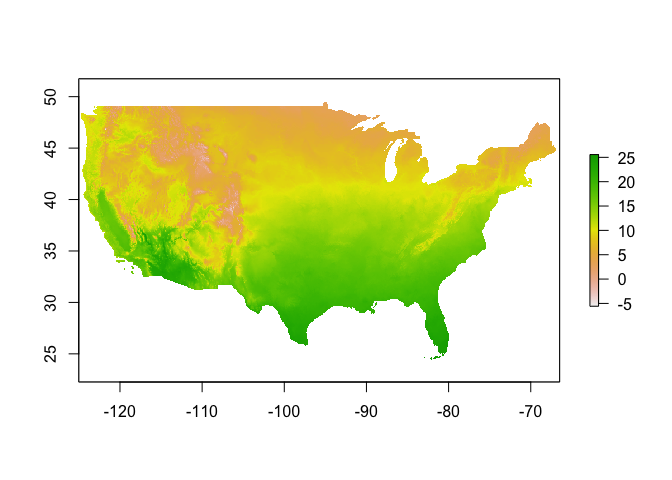
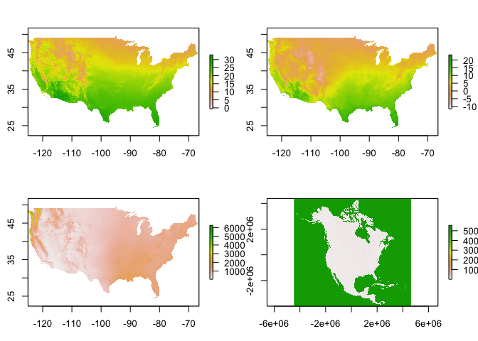
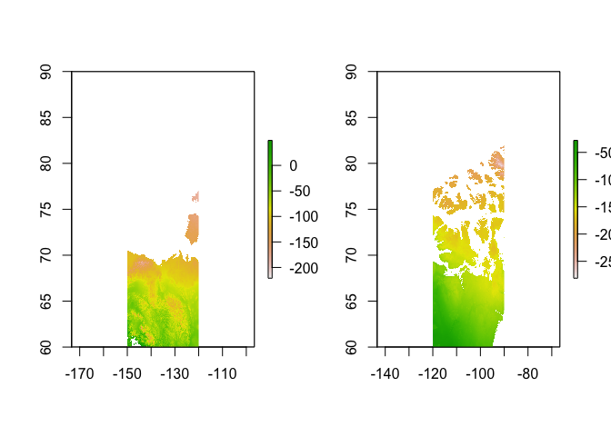
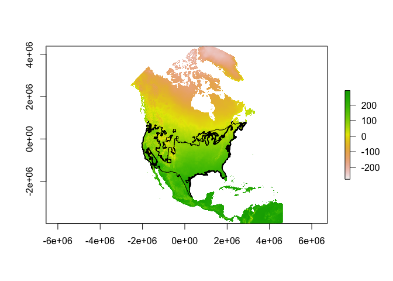

Day 1: Tutorial
================

Today's objective is to think about the input data for niche modeling. We will first think about sources of data and create a set of resources for you to use in your own work.

We will then move on to an example case study so that we can get learn how to explore and clean occurrence records and prepare raster layers for niche modeling.

------------------------------------------------------------------------

### **Case Study: Predicting Potential Invasion of the American Bullfrog**

Our Mission:
Use niche models to identify areas of Western North America that are environmentally suitable for the species (i.e. “at risk”).

NOTE: This is a bit of a “choose your own adventure”. You have several modeling decisions to make along the way and I don’t expect everyone to necessarily make the same decisions…or produce the same final model.

------------------------------------------------------------------------

### *Introductions*

#### **Exercise D1.1**

1.  Introduce yourself to the class:

-   Name and lab
-   What system are you working on?
-   What are you using niche models for?
-   Random bit of information about you that Google has probably already figured out using it’s fancy algorithms

Class shuffle: Sit with people working on same taxonomic group (at least for the next couple of exercises)

------------------------------------------------------------------------

### *Occurrence Records*

#### **Exercise D1.2**

1.  Working alone or in a small group, conduct an internet search and/or survey the relevant literature to find potential sources of occurrence records for the species/taxonomic group that you work on

When you have a few ideas about where to look, come see me and we’ll add them to the class resource page

#### **Exercise D1.3**

1.  Open the **“bullfrogLoc\_unfiltered.csv”** file and examine the dataframe
2.  What challenges do we face cleaning these data? What are some *a priori* decisions we can make as a class for filtering records?
3.  In your group: Using the tools described in lecture, georeference records 950 and 1133 (bring me your estimated coordinates when you are done)
4.  In your group: Clean your assigned portion of the records, filtering according to the descions made by the class.
5.  Save your subset of cleaned records as a new csv **"bullfrogLocs\_clean\_YOURGROUP.csv"**

**Some useful R commands for cleaning and subsetting data**

``` r
### Load the data as a dataframe

setwd("/<PATH_TO_FILES>") # insert the path to the "Data" directory
data<-read.csv("./bullfrogLocs_unfiltered.csv",stringsAsFactors=FALSE,header=TRUE)

### Basic ways to look at the dataframe

dim(data)       # get number of rows and columns
names(data)     # get column names
row.names(data) # get row names
str(data)       # get column names and data class of each column
head(data)  # get the first few rows of the dataframe
data$year       # example of getting a single column of data by column name
data[,1]            # example of getting a single column of data by column number
data[1,]            # example of getting a single row of data by row number
data[,c(1,7,9)] # get multiple columns by column number etc.

### Relevant tools for manipulating and subsetting the dataframe

# adding and substracting columns

data$haslength<-NULL        # remove the "haslength" column
data$new_column<-1      # create a new column and give all rows a value of 1 (for example)
new_df<-data[,1]        # create a new dataframe with only column 1 of the original dataframe
new_df<-data[,-1]       # create a new dataframe with everything EXCEPT column 1 of the original dataframe

# Subsetting based on specific values

data_yearGiven<-data[!(is.na(data$year)),]  # create a new dataframe excluding all rows without a year provided
data_noYear<-data[is.na(data$year),]            # create a new dataframe including only those rows without a year provided
data_recent<-data[which(data$year>=1980),]  # create a new dataframe including only records from 1980 onwards
data_1980<-data[which(data$year==1980),]        # create a new dataframe of records from 1980

unique(data$country)        # list all countries reported in dataframe
data$country[which(data$country=="United States")]<-"USA"       # find all rows where "United States" was given as the country and change to USA to be consistent across entries
data_NorthAm<-data[which(data$country=="Canada"|data$country=="USA"),]  # get records from North America only
NorthAm<-c("Canada","USA") # make a list countries you are interested in
data_NorthAm<-data[which(data$country %in% NorthAm),]       # an alternative way to get only records from North America
data_otherCountries<-data[!(data$country %in% NorthAm),]    # get records that aren't in North America

### Saving dataframes

write.csv(data_NorthAm,file="./Occurrences/bullfrogLocs_clean_YOURGROUP.csv",row.names=FALSE) # note will save to current directory; provide full path in filename if you want to save to another directory
```

A separate tool that may be useful for cleaning and filtering records: <http://openrefine.org>

------------------------------------------------------------------------

### *Environmental Rasters*

#### **Exercise D1.4**

1.  What types of environmental variables are you interested for your specific project? Working alone or in a small group, conduct an internet search to see if you can find GIS datasets representing these variables.

For each variable, note the region covered (e.g. county, country, continent)

When you have a list of data sources, come see me and we’ll add them to the class resource page

#### **Exercise D1.5**

Back to our case study...

1.  Download the tutorial environmental layers. Open them in R using the raster package (instructions on website)
2.  What do you notice about the layers? Any problems with them?
3.  Follow the instructions below to explore these layers and get them ready for tomorrow’s analysis.

``` r
### Load the raster package

library(raster)

### load and plot a raster

prism_tmean<-raster("./Environmental_Layers/PRISM_tmean/PRISM_tmean_30yr_normal_800mM2_annual_asc.asc")
plot(prism_tmean)
```



``` r
### load the other four layers and make multi-panel plot of these four

prism_tmax<-raster("./Environmental_Layers/PRISM_tmax/PRISM_tmax_30yr_normal_800mM2_annual_asc.asc")
prism_tmin<-raster("./Environmental_Layers/PRISM_tmin/PRISM_tmin_30yr_normal_800mM2_annual_asc.asc")
prism_precip<-raster("./Environmental_Layers/PRISM_precip/PRISM_ppt_30yr_normal_800mM2_annual_asc.asc")
wetness<-raster("./Environmental_Layers/wetness/na_cti.bil")

# plotting may take awhile...be patient

par(mfrow=c(2,2))
plot(prism_tmax)
plot(prism_tmin)
plot(prism_precip)
plot(wetness)
```



##### QUESTIONS:

1.  What do you notice?
2.  Do you anticipate any problems using these rasters?

``` r
### let's find out more information about the rasters
# below is mean temperature as an example

prism_tmean
```

    ## class       : RasterLayer 
    ## dimensions  : 3105, 7025, 21812625  (nrow, ncol, ncell)
    ## resolution  : 0.008333333, 0.008333333  (x, y)
    ## extent      : -125.0208, -66.47917, 24.0625, 49.9375  (xmin, xmax, ymin, ymax)
    ## coord. ref. : +proj=longlat +datum=NAD83 +no_defs +ellps=GRS80 +towgs84=0,0,0 
    ## data source : /Users/Julie/Documents/Teaching_and_Mentorship/SDM_workshop_2016/Data/Environmental_Layers/PRISM_tmean/PRISM_tmean_30yr_normal_800mM2_annual_asc.asc 
    ## names       : PRISM_tmean_30yr_normal_800mM2_annual_asc 
    ## values      : -12.29, 25.6  (min, max)

``` r
### stacking rasters is like making a pile of grids, one on top of the other, and facilitates manipulation of all the rasters at the same time

# try the following

prism_stack<-stack(c(prism_tmean,prism_tmax,prism_tmin,prism_precip))

# get info about this stack

prism_stack
```

    ## class       : RasterStack 
    ## dimensions  : 3105, 7025, 21812625, 4  (nrow, ncol, ncell, nlayers)
    ## resolution  : 0.008333333, 0.008333333  (x, y)
    ## extent      : -125.0208, -66.47917, 24.0625, 49.9375  (xmin, xmax, ymin, ymax)
    ## coord. ref. : +proj=longlat +datum=NAD83 +no_defs +ellps=GRS80 +towgs84=0,0,0 
    ## names       : PRISM_tmean_30yr_normal_800mM2_annual_asc, PRISM_tmax_30yr_normal_800mM2_annual_asc, PRISM_tmin_30yr_normal_800mM2_annual_asc, PRISM_ppt_30yr_normal_800mM2_annual_asc 
    ## min values  :                                    -12.29,                                    -6.88,                                   -17.70,                                   46.15 
    ## max values  :                                     25.60,                                    32.88,                                    23.33,                                 6640.51

``` r
# now try adding the wetness layer

all_layers<-stack(prism_stack,wetness)
```

##### QUESTIONS:

1.  Why didn't our attempt to make the second stack work?
2.  What is the projection of the prism temperature and preciptation layers?
3.  What is the projection of the wetness layer? (hint: this layer came from the USGS Hydro1 project: <https://lta.cr.usgs.gov/HYDRO1K>)
4.  What other differences do you notice between these layers?
5.  The PRISM data may not be appropriate for our analysis. Why?

Let's get some alternative temperature and preciptation layers:

1.  Go to the worldclim website <http://www.worldclim.org/>
2.  Download the *current BIOCLIM* layers roughly equivalent to tmean (BIO1), tmax (BIO5), tmin(BIO6) and precip (BIO12). Do this BY TILE (e.g. to avoid filling your hard drive), ensuring that you completely cover North America
3.  If there are other variables that you think may be relevant, feel free to download those
4.  Create a new directory: "BIOCLIM" within the Data/Environmental\_Layers directory; Move the set tiles for each variable into new folders (e.g. "tmean","tmax"...etc.) in this BIOCLIM directory. You should have a folder for each variable that includes all North American tiles for that variable.

Now we need to stitch together the tiles for each variable and then process each variable so that we can stack with our wetness variable.

``` r
### First read a couple of rasters and plot them side by side 

r1<-raster("./Environmental_Layers/BIOCLIM/tmean/bio1_01.tif")
r2<-raster("./Environmental_Layers/BIOCLIM/tmean/bio1_02.tif")

par(mfrow=c(1,2))
plot(r1)
plot(r2)
```



``` r
### Stitch them together using the "merge" function

m<-merge(r1,r2)
plot(m)
```


``` r
### We can automate the process

# make a list of all files

files<-list.files(path="./Environmental_Layers/BIOCLIM/tmean/",full.names=TRUE) 
# NOTE: reading rasters doesn't work well with relative path names so just create a list with full path names 

m<-raster(files[1]) # initiate the merged raster by reading in file 1

# now loop through the remaining rasters, merging them one at a time (this takes awhile)

for (f in 2:length(files)){
    r<-raster(files[f])
    m<-merge(m,r)
}

tmean<-m
```

``` r
# take a look
plot(tmean)

# save the new raster (I like GeoTiff format)

writeRaster(tmean,"./Environmental_Layers/tmean",format="GTiff")
```

Repeat the merge process above for the other layers

Take a look at the info for one of your merged layers
Will we be able to "stack" this layer with the wetness layer?

Let's reproject our BIOCLIM layers so that they have the same projection as the wetness layer. We will use the projection of the wetness layer because it is an equal area projection and that's good for niche modeling (more on this another day).

``` r
### NOTE:
# You need to make sure that R knows the projection of the layers in question
# If you encounter layers that don't have a projection detected, you can assign it using the following:

proj4string(myRaster)<-CRS("+proj=longlat +ellps=GRS80 +datum=NAD83") 

# the string inside the CRS command will vary depending on the projection associated with the raster
# Here's a site where you can find common projection strings: http://www.spatialreference.org
```

``` r
### Project the tmean layer

# First assign the appropriate projection to the wetness layer

crs_wet<-"+proj=laea +lat_0=45 +lon_0=-100 +x_0=0 +y_0=0 +a=6370997 +b=6370997 +units=m +no_defs"
crs(wetness)<-crs_wet

# Now use the raster package "projectRaster" tool to project the tmean raster using the wetness raster as a template

tmean_laea<-projectRaster(tmean,wetness)
```

Stack the rest of your merged BIOCLIM layers and project them as a stack.
Then try stacking the projected layers and the wetness layer. Does it work?

``` r
### An alternative way to align your layers in terms of both projection, extent and resolution is to use the "spatial_sync_raster" from the "spatial.tools" package
# This might be necessary if the resolutons were different (BIOCLIM and the wetness index are both at the same spatial resolution)

library(spatial.tools)
tmean_laea<-spatial_sync_raster(tmean,wetness,method="bilinear")
```

Our final task is to crop the projected rasters to an extent that is appropriate for our case study. Working with smaller rasters will save on processing time and disk space.

To decide on an appropriate study extent, let's first take a look at the distribution of the bullfrog. The range of this species is provided as a shapefile (originally downloaded from the IUCN redlist: <http://www.iucnredlist.org/technical-documents/spatial-data>)

Let's use the maptools package to take a look.

``` r
library(maptools)
```

    ## Checking rgeos availability: TRUE

``` r
### Read in the range shapefile (Note: there are two shapefiles, choose the full range in North America)

range<-readShapePoly("./Range_Maps/bullfrog_NorthAmericanRange.shp",proj4string=CRS("+proj=longlat +ellps=WGS84 +datum=WGS84 +no_defs +towgs84=0,0,0"))
```

``` r
### Take a look at the species' range

plot(range)
```

``` r
### The range is unprojected. We will want to project it to match the projection of our environmental layers.

laea<-proj4string(tmean_laea) # define the projection using our projected tmean layer as a template
range_laea<-spTransform(range,laea)

### Plot the species' range overtop one of our environmental layers

plot(tmean_laea)
plot(range_laea,add=TRUE)
```



``` r
### Using the coordinates and units printed along the axes of the plot as a guide we can decide on a more limited study extent (note we should keep in mind that eventually we want to project across the western USA and Canada so not too limited!)

e<-extent(c(-2500000,3000000,-3000000,1000000))
plot(tmean_laea)
plot(range_laea,add=TRUE)
plot(e,add=TRUE)
```


``` r
# Does that extent look good? If so we can crop our layers (If not try a different extent until you find one you like)

tmean_final<-crop(tmean_laea,e)
```

``` r
plot(tmean_final)
```

``` r
# all this work! Save those layers

writeRaster(tmean_final, "./Environmental_Layers/tmean_final",format="GTiff")
```

You can crop all the environmental layers at once using a raster stack.

You now have all the R commands you need to prepare a final set of rasters for our case study.

Make sure that by tomorrow you have:
1) A clean version of the subset of occurrence records assigned to you.
2) At least the four bioclim and one wetness raster projected and cropped (you should be able to stack the rasters, if not, something has gone wrong). Clean up your Environmental\_Layers folder by move everything except these final rasters to a subfolder called "Temp".

##### ADVANCED CHALLENGE:

See if you can figure out how to further verify that only appropriate occurrence records remain in your cleaned file by making sure records fall into the native range of the species.

HINTS: If there are records outside of the native range, you can get the intersection of the native range shapefile and the occurrence records. Check out the "over"" function in the "sp"" package and the "gIntersection" function in the "rgeos"" package. You may also have to do some reading up on this online to figure out how.
