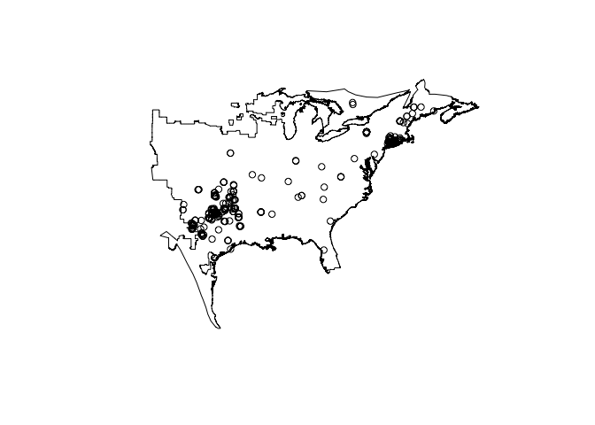
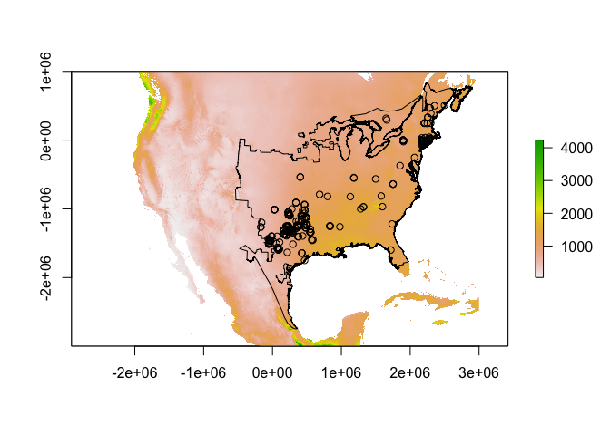
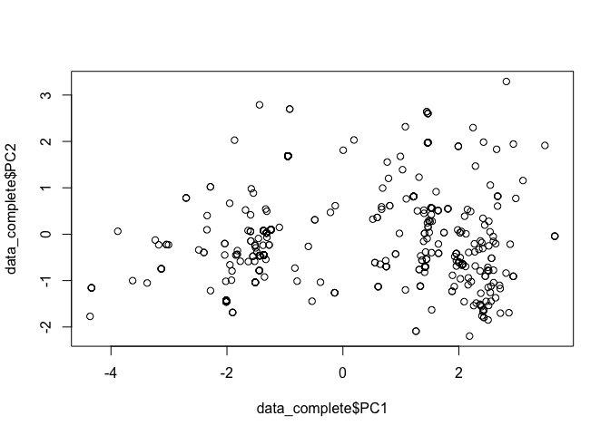
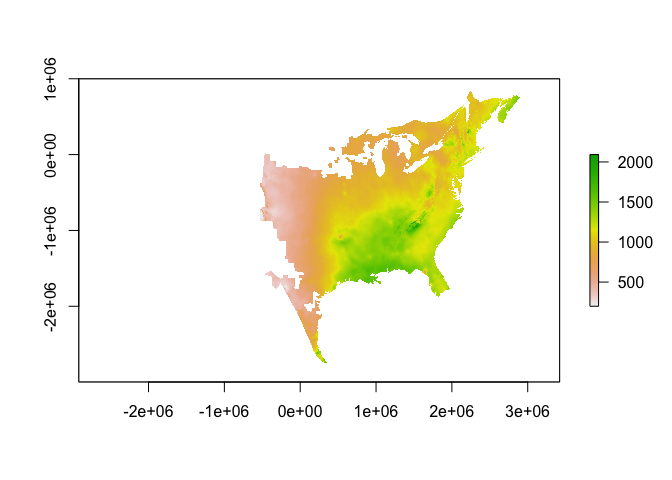
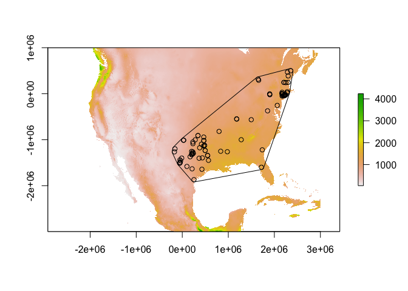
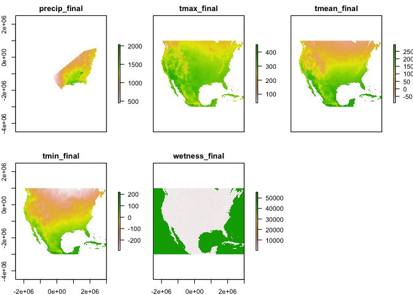
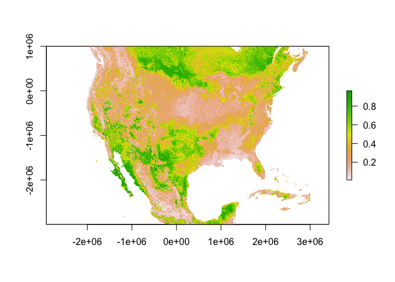

Day 2: Tutorial
================

Today's objective is do a little bit more thinking about the data we use in specific niche modeling projects and to introduce ourselves to niche modeling in R.

NOTE: Please save a version of the Rscript you use in this and subsequent tutorials. Having a record of the specific commands you use and the ways they differ from the ones below (preferrably with comments explaining your decisions) will greatly facilitate any troubleshooting we have to do.

------------------------------------------------------------------------

### *Sampling Bias*

#### **Exercise D2.1**

1.  Examine the distribution of our filtered frog localities in geographic and environmental space.
2.  Thin these locality records based on geography and then based on environment. Compare the full dataset to the thinned dataset in both cases in environmental space.
3.  Decide on the method of thinning (if any) that you want to use for our case study. Be sure to write down your reasoning.

Let's first examine our records in geographic space.

``` r
### Load all relevant files
setwd("<PATH_TO_CLASS_FOLDER>") # insert the path to the "Data" directory
```

``` r
library(maptools)

data<-read.csv("./Data/Occurrences/bullfrogLocs_clean.csv",stringsAsFactors=FALSE,header=TRUE) # By now we have a final set of occurrence records filtered to the native range of the species. 

range<-readShapePoly("./Data/Range_Maps/bullfrog_NativeRange.shp",proj4string=CRS("+proj=longlat +ellps=WGS84 +datum=WGS84 +no_defs +towgs84=0,0,0")) # The model will be based on the native range.

# Plot the localities overtop the native range
# Your map will look different from the example below, which is based on only a quick and dirty subset of the records

plot(range)
points(data[,c("decimallongitude","decimallatitude")])
```



##### QUESTIONS:

1.  Are there regions of the native range that are under-represented?
2.  Are there regions of the native range that are over-represented?

``` r
### Let's now examine our records in geographic space

library(raster)

# Load the environmental layers

files<-list.files(path="./Data/Environmental_Layers",pattern="_final.tif",full.names=TRUE)
layers<-stack(files)

# The raster layers are in a different projection than both our occurrence records and range maps. Let's reproject the latter two inputs.

# define the projection
laea<-proj4string(layers)

# First the occurrence records
# Subset them to be a bit more amenible for maxent

locs<-data[,c("scientificname","decimallongitude","decimallatitude")]
names(locs)<-c("taxa","x","y") # rename the columns to be a bit more conventional
coordinates(locs)<-~x+y # convert to SpatialPointsDataframe 
proj4string(locs)<-"+proj=longlat +ellps=WGS84 +datum=WGS84 +no_defs +towgs84=0,0,0" # tell R what the original projection of the occurrence records is
locs_laea<-spTransform(locs,CRS=CRS(laea)) # project the data

# Now the range shapefile

range_laea<-spTransform(range,CRS=CRS(laea))

# check that everything looks right
plot(layers[[1]])
plot(range_laea,add=TRUE)
points(locs_laea) # note here that because locs_laea is a spatial object, we don't need to specify the coordinate columns in the points command
```



``` r
# Let's save the projected shapefile so we don't have to do this step again. Note: you may want to quickly repeat the above procedure for the full range...we might need that in subsequent steps.

writePolyShape(range_laea,"./Data/Range_Maps/bullfrog_NativeRange_laea.shp")

# Now let's extract environmental information about our localities so that we can examine them in environmental space 

values<-extract(layers,locs_laea)

# Make a new dataframe with the projected coordinates and these values. Include the original unprojected coordinates (we need them below). Examine the resulting dataframe. 

data_values<-cbind(as.data.frame(locs_laea),data[,c("decimallongitude","decimallatitude")],values)
```

##### QUESTIONS:

1.  Do you have any NAs in the resulting dataframe of environmental values?
2.  What might NAs signal?

``` r
# Let's use PCA to examine the distribution of points in environmental space
# You could use other ordination techniques...

# We are going to have to first get rid of NAs (standard PCA does not work with missing data)

data_complete<-data_values[complete.cases(data_values),]
pca<-prcomp(data_complete[,c(6:10)],scale=TRUE,center=TRUE) # 6:10 specifies the columns with the environmental data

# Add the PCA scores of each site for the first three PC axes to our dataframe

data_complete<-cbind(data_complete,pca$x[,1:3])

# Let's plot the points in PC space
# Again, your plot should look different from my example here

plot(data_complete$PC1,data_complete$PC2)
```



##### QUESTIONS:

1.  Are there regions of environmental space that are under-represented? Is this a problem?
2.  Do we have any obvious clumping of records in environmental space?

#### Thinning Records

There are multiple suggestions in the literature for thinning records/ dealing with spatial autocorrelation in a locality dataset. There are also multiple types of software and R packages for this. We will use a couple of these today (not necessarily my favourites) but in your own work, you probably want to read up on the strengths and weaknesses of different approaches.

``` r
### Let's thin records based on geographic distance.
# We will use the spThin package but see also dismo's gridSample function 

library(spThin)

# We first have to make sure the species is called the same thing in all rows
data_complete$taxa<-"Lithobates catesbeianus"

# Use the thin command with the original lat/long coordinates to created a thinned dataset.
```

``` r
geo_thinned<-as.data.frame(thin(data_complete,lat.col="decimallatitude",long.col="decimallongitude",spec.col="taxa",thin.par=100,reps=1,locs.thinned.list.return=TRUE,write.files=FALSE))

# Take a look at the thinning results

plot(range) # unprojected
points(data_complete[,c("decimallongitude","decimallatitude")])
points(geo_thinned[,c("Longitude","Latitude")],col="red")
```

##### QUESTIONS:

1.  What does the thin.par=100 parameter mean? What happens if you increase this value? Decrease it? Do you think we should be using a different value?
2.  Go through the steps above to get the distribution of our thinned records in PC space (name things differently so you can compare the old and new plots). Did the thinning result improve the distribution of points in environmental space?

``` r
### Let's thin records based on environmental space
# For this we can "hack" the gridSample funciton in the dismo package 

library(dismo)

# First, because we've been subsetting our cleaned dataframe and now have row numbers that aren't consecutive, let's rename our rows. 
# We want to do this because we will later want to use our row indices

row.names(data_complete)<-1:length(data_complete[,1])

# To thin in environmental space, let's make dummy raster, the "extent" of which are the range of our PC1 and PC2 values

dum<-raster(extent(range(data_complete[,"PC1"]),range(data_complete[,"PC2"]))+0.5) # in addition to reading in rasters, the raster function can be used to define them manually
res(dum)<-0.5 # set the resolution of the dummy raster
sample<-gridSample(data_complete[,c("PC1","PC2")],dum,n=1)
```

``` r
# Now you can look at the original and thinned points in PC space

plot(data_complete[,c("PC1","PC2")])
points(sample,col="red")
```

``` r
# The gridSample function only returns the row names and "xy" values (in this case PC1 and PC2) of the thinned points. We want the other columns so let's take advantage of the row numbers to get the full thinned dataframe.

env_thinned<-data_complete[which(row.names(data_complete) %in% row.names(sample)),]
```

##### QUESTIONS:

1.  Did the geographic method perform similarly in terms of reducing clustering in environmental space?
2.  What are some of the challenges of thinning based on geographic distances?
3.  What are some of the challenges of thinning based on environmental space? What do you make of the use of the PCA analysis to accomplish this task?
4.  Are there any drawbacks to thinning in general?
5.  Which method of thinning (if either) do you think is appropriate for our case study? Save the corresponding dataframe. Note: This is where we may start to all diverge in the decisions we make for this case study!

``` r
### Save your final (thinned) set of occurrence records (even if you decided not to thin)

write.csv(<DATAFRAME>, "./Data/Occurrences/bullfrogLocs_clean_thinned.csv",row.names=FALSE) # insert the dataframe from above that you think is best 
```

##### ADVANCED CHALLENGE:

The environmental filtering we did above only dealt with the first two axes of variation in our PCA analysis. Can you think of a way to extend this type of approach to handle multivariate data (not necessarily PCA-converted).
HINT: Think about the types of matrices used by ecologists to describe the similarity/dissimilarity of sites.

Also Sara Varela has generated this script for this purpose (I haven't had a chance to verify it yet but take a look!)
<https://github.com/SaraVarela/envSample/blob/master/R/envSample.R>

------------------------------------------------------------------------

### *Variable Selection*

#### **Exercise D2.2**

1.  Using both the information you have about the species and a correlation analysis, decide on at least three biologically relevant variables for inclusion in the niche model.
2.  Are there any variables you don't have but think you should?

``` r
### Let's examine the extent to which our environmental variables are correlated

# Get the layers
library(raster)

files<-list.files(path="./Data/Environmental_Layers",pattern="_final.tif",full.names=TRUE)
layers<-stack(files)

# First consider the question at hand: WHERE are we interested in correlations between the variables?
# Intially, for model calibration purposes, we might only want to consider correlations within the potential training data: presences and background sites. 
# So let's first "mask" our environmental layers to an extent that we think will be useful for model calibration.
# Different options: 
# 1) The native range of the species
# 2) The full range of the species in North America
# 3) Other?

# Here's an example using the native species' range.

range_laea<-range<-readShapePoly("./Data/Range_Maps/bullfrog_NativeRange_laea.shp",proj4string=CRS(proj4string(layers)))

# Mask the first layer

m<-mask(layers[[1]], range_laea)

plot(m)
```



``` r
# Now we can regularly sample points from within this region to run our correlation analysis

p<-sampleRegular(m, size=1000, xy=TRUE) 

# Extract values from all layers for these points and run a standard correlation analysis
# Note that you could use the "cor" function below on two rasters without sampling but this is computationally expensive!

values<-extract(layers,p[,c("x","y")])
correlations<-cor(values,use="na.or.complete",method="pearson")

# Take a look at the results
correlations
```

    ##               precip_final tmax_final tmean_final tmin_final wetness_final
    ## precip_final   1.000000000 -0.1216898  0.21439815  0.2840460  -0.003377583
    ## tmax_final    -0.121689837  1.0000000  0.84899435  0.7054688   0.123481636
    ## tmean_final    0.214398152  0.8489944  1.00000000  0.9554439   0.026514814
    ## tmin_final     0.284045996  0.7054688  0.95544388  1.0000000  -0.073746701
    ## wetness_final -0.003377583  0.1234816  0.02651481 -0.0737467   1.000000000

``` r
# You can make it easier to find highly correlated variables (ie. >0.75) in the following way

low<-which(abs(correlations)<0.75)
high_correlations<-replace(correlations,low,".")

high_correlations
```

    ##               precip_final tmax_final          tmean_final        
    ## precip_final  "1"          "."                 "."                
    ## tmax_final    "."          "1"                 "0.848994351592974"
    ## tmean_final   "."          "0.848994351592974" "1"                
    ## tmin_final    "."          "."                 "0.955443884826188"
    ## wetness_final "."          "."                 "."                
    ##               tmin_final          wetness_final
    ## precip_final  "."                 "."          
    ## tmax_final    "."                 "."          
    ## tmean_final   "0.955443884826188" "."          
    ## tmin_final    "1"                 "."          
    ## wetness_final "."                 "1"

##### QUESTIONS:

1.  Which pairs of variables are highly correlated in your version of the analysis?
2.  For each *pair* of highly correlated variables, decide on one to keep.
3.  When might we decide not to remove highly correlated variables? When do we have to?

If you think a different background extent is more appropriate for the niche model, you can try out some of the following code to generate your background extent and then repeat the steps above to test for correlations between your variables.

``` r
### Different background extents

library(rgeos)
library(adehabitatHR)

# Minimum convex polygon around the locality data

mcp<-mcp(locs_laea,unit="m",percent=100)
mcpb<-gBuffer(mcp,width=5000) # put a small buffer on the mcp otherwise, your points on the boundary (including your locality vertices) will be excluded in subsequent analyses
m2<-mask(layers[[1]], mcpb)

# Buffered points background 

bp<-gBuffer(locs_laea,width=100000)
m3<-mask(layers[[1]], bp)

# A rectangular extent around the native range

e<-as(extent(range_laea),"SpatialPolygons") # or you can manually generate an extent
m4<-mask(layers[[1]],e)

# NOTE: If you decide to use one of the above background extents instead of the native range, save it to file.

# In order to write a polygon to file using maptools, you need to first convert it to a SpatialPolygonDataframe. Here's some code for the mcp (buffered version)

pid <- sapply(slot(mcpb, "polygons"), function(x) slot(x, "ID"))
mcpb_df<-data.frame(ID=1:length(mcpb),row.names=pid)
mcpb_spd<-SpatialPolygonsDataFrame(mcpb,mcpb_df)
writePolyShape(mcpb_spd,"./Data/Range_Maps/mcp_range.shp")
```

If you decided to remove some of your variables. Move them to your "Temp" subfolder from yesterday. Your Environmental\_Layers folder should now only have variables you will use to build your niche models.

------------------------------------------------------------------------

### *Basic MAXENT Modeling*

Now that you have thought carefully about the input data, it's time to get familiar with using R to build niche models. We are going to be using MAXENT and the dismo package but keep in mind that for your own research, you should think carefully about what modeling algorithms are best for your questions.

#### **Exercise D2.3**

1.  Use the dismo package to build a MAXENT niche model in R using your final occurrence records and raster layers.
2.  Create a simple plot of model predictions across the native range of the species.
3.  Save your model.

``` r
### Get all the files ready to build the model

library(raster)
library(maptools)

# Occurrence Records

locs<-read.csv("./Data/Occurrences/bullfrogLocs_clean_thinned.csv",header=TRUE)

# Environmental Rasters

files<-list.files(path="./Data/Environmental_Layers",pattern="_final.tif",full.names=TRUE)
layers<-stack(files)

# Background extent for modeling

background<-readShapePoly("./Data/Range_Maps/mcp_range.shp") # I'm using the MCP around our locality data as my background extent (you won't have this file unless you saved a similar one), but you can choose whatever background file you decided upon above

# plot everything to make sure it looks good

plot(layers[[1]])
points(locs[,c("x","y")])
plot(background,add=TRUE)
```



``` r
### Mask our environmental layers

# In order to force MAXENT to choose background points from within our background extent, we need to mask at least one of the layers so that areas outside of the background are NA. 

m<-mask(layers[[1]],background) # mask the first raster
calibrationRasters<-stack(m,layers[[2:nlayers(layers)]]) # stack this new version of layer 1 with the remaining rasters
names(calibrationRasters)[1]<-names(layers)[1] # rename the first raster in new stack to it's original name 

# Plot to see that it worked; The first raster plotted should be in the shape of our background extent

plot(calibrationRasters)
```



Now we are ready to think about the "maxent"" command in dismo.

Outside of R, open the help file of the MAXENT GUI. There you will find a list of all the parameters that can be set via the "arg" option in the maxent commend.

``` r
### MAXENT model calibration

# Create a vector describing the arguments we want to give to MAXENT

myArgs<-c("-J","-P","removeDuplicates=TRUE","writebackgroundpredictions", "maximumiterations=5000")
```

##### QUESTIONS:

1.  What do each of these setting mean?
2.  Why might we want to change the maximumiterations parameter away from the default settings?
3.  Are there any other parameters you want to set differently from the defaults? Change the myArgs vector appropriately if there are.

NOTE: Some of the parameters in the help file are only relevant to the prediciton stage. We will further delve into some of the more complicated parameters tomorrow, so don't worry too much about these for now.

``` r
### Now let's calibrate our first model

dir<-"./MaxentModels"
dir.create(dir)

me<-maxent(calibrationRasters,locs[,c("x","y")],args=myArgs,path=dir)
```

Take a look at the different output files produced. The maxent.html file is a particularly important file for a quick summary of the results but quickly look through the other files to familarize yourself with the various outputs.

``` r
### Let's make a map of model predictions

prediction<-predict(me,layers) # use the original layers to get predictions across North America 

plot(prediction)
```



##### QUESTIONS:

1.  How different is your prediciton from what is shown here?
2.  What might account for these differences?
3.  Do either of our models do a particularly good job of predicting the species native or invasive range?

Finally let's save our model object in case we want to import it back into R to do something with it later.

``` r
### Save the model object to file

save(me,file="./MaxentModels/model_object")
```

So we have a model!

But wait...we are not done yet. This model should be considered fairly preliminary.
Tomorrow we will delve into more of the settings in MAXENT, model evaluation and some caveats about using our models to make predictions.
